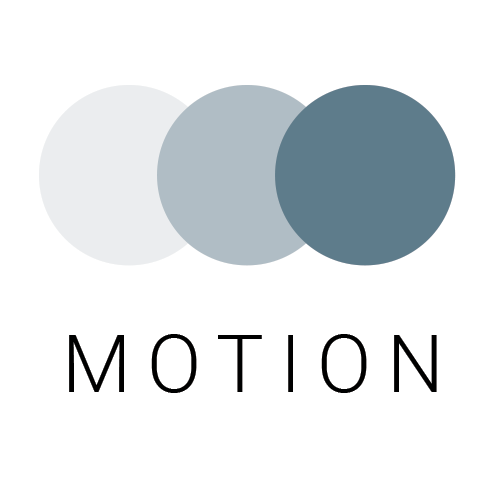

# MOTION (WORK IN PROGRESS)

<br/>  
  
<br/>  
<br/>  
  
<br/>  

Animation plays a huge part in a UX and is one of the fundamental building blocks of Material design.
So, Motion as a sample app will be the demonstration of animations using every existent library and tool on Android. Detailed documentation will be provided as well.

# TODO
- [x] ~~Shared elements animation using architecture components~~  
- [ ] Shared elements animation (regular way)
- [ ] Material transitions
- [ ] View animations
- [ ] VectorDrawable animations
- [ ] Physics based animations
- [ ] Circular reveal
- [ ] TransitionManager animations
- [ ] ConstraintLayout animations
- [ ] MotionLayout animations


# LICENSE
 
``` 
Copyright 2019 Rami Jemli

Licensed under the Apache License, Version 2.0 (the "License");
you may not use this file except in compliance with the License.
You may obtain a copy of the License at

    http://www.apache.org/licenses/LICENSE-2.0

Unless required by applicable law or agreed to in writing, 
software distributed under the License is distributed on an "AS IS" BASIS, 
WITHOUT WARRANTIES OR CONDITIONS OF ANY KIND, either express or implied. 
See the License for the specific language governing permissions 
and limitations under the License.
``` 
